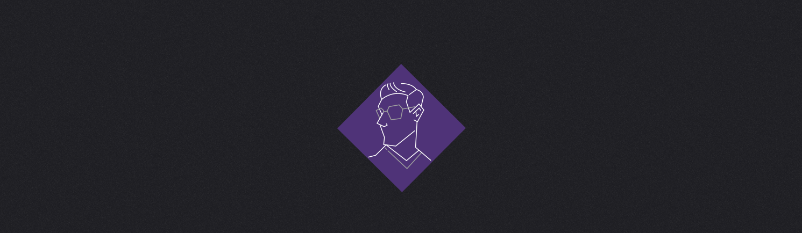

### Hi there 🖐🏾

🙈 

## ⌨️ Technologies and Tools
    
🌱 I’m currently learning:   

  
  
 

## Projects 

### Project Davinci
An Random pasword Generator 
- Live Project [Project Davinci](https://projectdavinci.herokuapp.com/)
- Github [Project Davinci](https://github.com/CubeVic/Project_Davinci)

### Project Task Master
A To DO list, with option to create, edit and delete task
- Live Project [Project Task Master](https://projectthetaskmaster.herokuapp.com/)

### Project Hangman
A simple game of hangman, it use the Python wrapper for the API datamuse to ftch random words to use in the game.
- GitHub [Project Hangman](https://github.com/CubeVic/Project_Hangman)

## 📥 Contact
📫 How to reach me: victoraguirre.f@gmail.com

<!--
**CubeVic/CubeVic** is a ✨ _special_ ✨ repository because its `README.md` (this file) appears on your GitHub profile.

Here are some ideas to get you started:

- 🔭 I’m currently working on ...
- 🌱 I’m currently learning ...
- 👯 I’m looking to collaborate on ...
- 🤔 I’m looking for help with ...
- 💬 Ask me about ...
- 📫 How to reach me: ...
- 😄 Pronouns: ...
- ⚡ Fun fact: ...
-->
